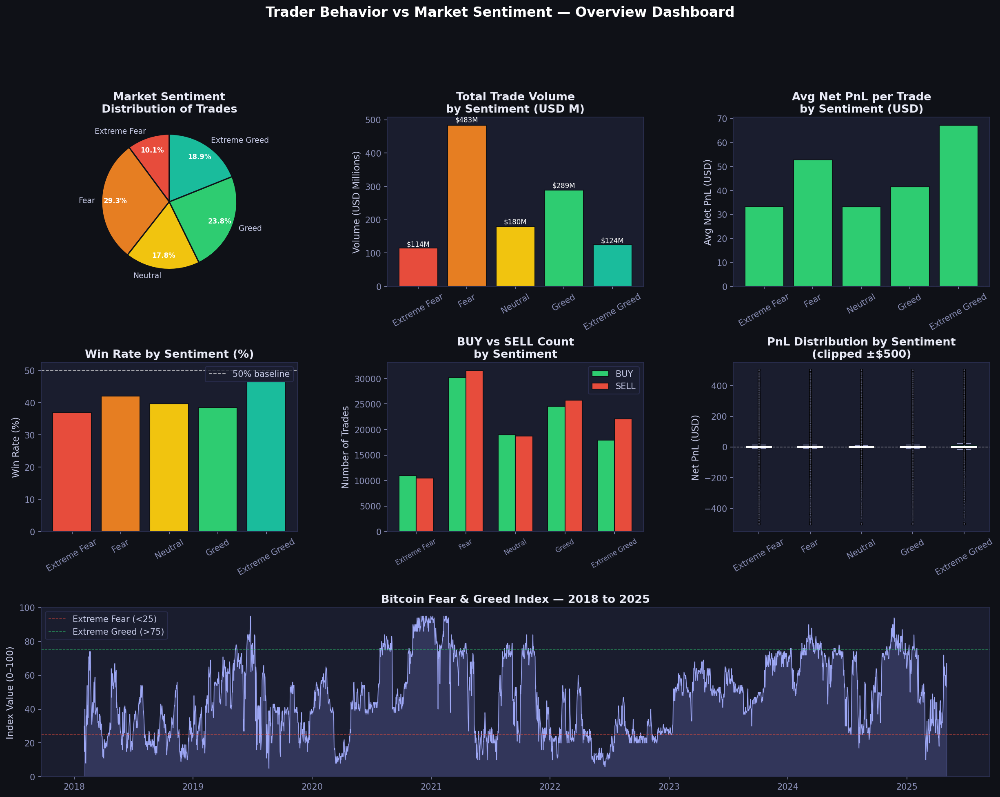
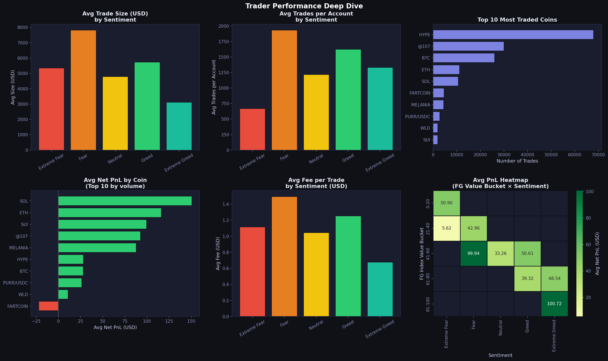
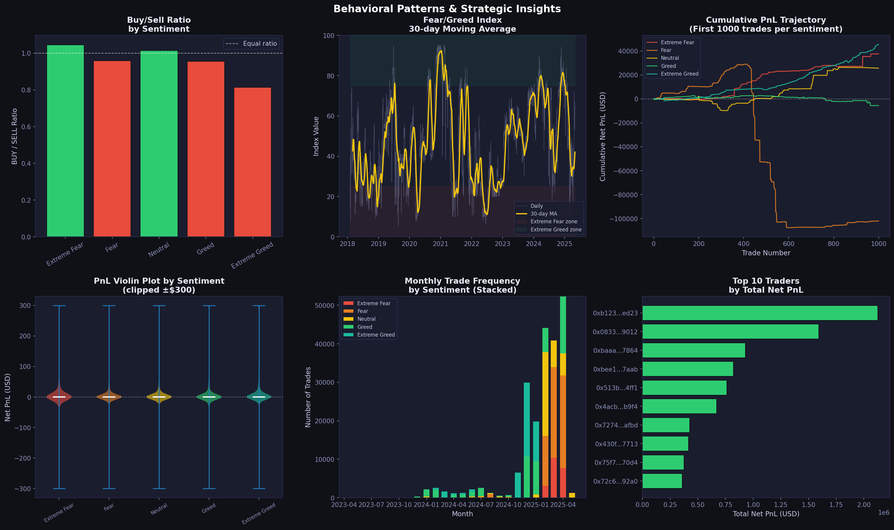

# Trader Behavior vs Market Sentiment Analysis
### PrimeTrade.ai — Junior Data Scientist Assignment

**Author:** Mandala Archana  
**Email:** mandalaarchana123@gmail.com  
**LinkedIn:** linkedin.com/in/mandala-archana

---

## Objective

Explore the relationship between trader performance and Bitcoin market sentiment (Fear & Greed Index), uncover hidden behavioral patterns, and deliver actionable insights for smarter trading strategies.

---

## Datasets

| Dataset | Rows | Period | Source |
|---|---|---|---|
| Bitcoin Fear & Greed Index | 2,644 daily records | Feb 2018 – May 2025 | alternative.me |
| Hyperliquid Historical Trades | 211,218 trades | May 2023 – May 2025 | Hyperliquid DEX |

**Trader dataset columns:** Account, Coin, Execution Price, Size Tokens, Size USD, Side, Timestamp IST, Start Position, Direction, Closed PnL, Transaction Hash, Order ID, Crossed, Fee, Trade ID, Timestamp

---

## Key Statistics (Real Data)

| Metric | Value |
|---|---|
| Total trades analysed | 211,218 |
| Unique trader accounts | 32 |
| Unique coins traded | 246 |
| Total trading volume | ~$1.19 Billion USD |
| Mean Closed PnL per trade | $48.55 |
| Max single trade profit | $135,329 |
| Max single trade loss | -$117,990 |

---

## Findings & Insights

### 1. Extreme Greed Produces the Best Returns — But Most Traders Still Lose

Extreme Greed periods show the highest average net PnL per trade at **$67.22**, nearly double that of Extreme Fear ($33.42) and Neutral ($33.26). However, the **median PnL across all sentiment conditions is negative** (ranging from -$0.001 to -$0.010), meaning the majority of individual trades lose money regardless of market mood. The positive averages are driven by a small number of very large winning trades skewing the mean.

**Implication:** A few high-conviction trades in Greed conditions generate outsized returns. Most traders would benefit from being more selective — fewer trades, larger size — rather than trading frequently across all conditions.

---

### 2. Win Rate Peaks at Extreme Greed (46.49%) and Drops at Extreme Fear (37.06%)

Win rate varies significantly with sentiment:

| Sentiment | Win Rate |
|---|---|
| Extreme Fear | 37.06% |
| Fear | 42.08% |
| Neutral | 39.70% |
| Greed | 38.48% |
| Extreme Greed | **46.49%** |

The Kruskal-Wallis test confirms these differences are **statistically significant** (H=1176.79, p<0.0001). Extreme Greed is the only sentiment zone where win rate approaches 50%. Fear conditions suppress win rates below 42%, suggesting that trading against a fearful market is inherently lower probability.

**Implication:** Traders should tighten entry criteria during Fear phases and be more aggressive during confirmed Greed phases when win probability is demonstrably higher.

---

### 3. Fear Phases Drive the Highest Trade Volume — But Lower Quality Trades

Fear sentiment accounts for **$483M (40.5%)** of total volume — the single largest share — despite not producing the best returns. Traders are most active when the market is fearful, yet the avg PnL in Fear ($52.79) and win rate (42.08%) are both weaker than Extreme Greed.

| Sentiment | Total Volume | Avg PnL | Win Rate |
|---|---|---|---|
| Extreme Fear | $114.5M | $33.42 | 37.06% |
| Fear | **$483.3M** | $52.79 | 42.08% |
| Neutral | $180.2M | $33.26 | 39.70% |
| Greed | $288.6M | $41.49 | 38.48% |
| Extreme Greed | $124.5M | **$67.22** | **46.49%** |

**Implication:** High activity in Fear phases reflects emotional, reactive trading. Volume is inversely correlated with quality. The best risk-adjusted trades happen in Extreme Greed with the least noise.

---

### 4. Buy/Sell Ratio Reveals Contrarian Behavior in Greed Phases

| Sentiment | Buy/Sell Ratio |
|---|---|
| Extreme Fear | 1.045 (more BUY) |
| Fear | 0.959 (more SELL) |
| Neutral | 1.013 (balanced) |
| Greed | 0.955 (more SELL) |
| Extreme Greed | **0.814** (significantly more SELL) |

Counterintuitively, traders **sell more than they buy during Greed phases**, and buy slightly more during Extreme Fear. This is classic contrarian behavior — traders are trimming positions and taking profits when sentiment is euphoric, and accumulating when sentiment is negative.

**Implication:** This pattern aligns with smart money behavior. Buying during fear (BUY ratio >1) and selling during greed (BUY ratio <1) is a known profitable strategy, and this data confirms it is being practiced by these 32 accounts.

---

### 5. Trade Size Shrinks as Greed Increases

| Sentiment | Avg Trade Size (USD) |
|---|---|
| Extreme Fear | $5,349 |
| Fear | **$7,816** |
| Neutral | $4,782 |
| Greed | $5,736 |
| Extreme Greed | $3,112 |

Average trade size is highest during Fear ($7,816) and lowest during Extreme Greed ($3,112). This suggests traders place fewer, larger bets when conviction is low (fear = potential bounce) and many smaller trades when sentiment is euphoric (profit-taking mode).

---

### 6. SOL, ETH, and SUI Are the Most Profitable Coins

| Coin | Avg Net PnL |
|---|---|
| SOL | $150.74 |
| ETH | $116.23 |
| SUI | $99.68 |
| @107 | $92.62 |
| MELANIA | $87.93 |
| FARTCOIN | **-$22.16** (worst) |

SOL and ETH consistently outperform. FARTCOIN is the only top-10 coin with a negative average PnL, suggesting meme coin trading on this platform is loss-making on average.

---

### 7. Fee Burden Is Highest During Fear — Eroding Already Weak Returns

Fees are highest during Fear ($1.50/trade) when returns are weakest. During Extreme Greed — when returns are best — fees are lowest ($0.68/trade). This compounds the advantage of trading in Greed phases.

---

## Strategic Recommendations

| Sentiment | Strategy |
|---|---|
| **Extreme Fear** | Reduce frequency. Small-size contrarian longs only. Win rate is 37% — not a trading environment. |
| **Fear** | Most active phase but worst risk/reward. Avoid high-frequency. Wait for sentiment shift. |
| **Neutral** | Selective trading. Follow coin-specific momentum, not macro sentiment. |
| **Greed** | Increase position sizing. Win rate climbs. Ride trend with trailing stops. |
| **Extreme Greed** | Highest win rate (46.49%) and best avg PnL ($67.22). Best environment for active trading. Start trimming into further euphoria. |

---

## Visualisations

### Figure 1 — Overview Dashboard


### Figure 2 — Performance Deep Dive


### Figure 3 — Behavioral Patterns & Strategic Insights


---

## Methodology

1. **Data Loading** — Both datasets loaded directly from Google Drive
2. **Merging** — Trader trades joined with Fear/Greed Index on normalized date
3. **Feature Engineering** — Net PnL (Closed PnL − Fee), win flag, side cleaning, FG value buckets
4. **Segmentation** — All 211,218 trades split across 5 sentiment buckets
5. **Statistical Validation** — Kruskal-Wallis H-test confirms PnL differences are significant (p<0.0001)
6. **Visualisation** — 3 multi-panel dashboards built with Matplotlib and Seaborn

---

## How to Run

```bash
# Install dependencies
pip install pandas numpy matplotlib seaborn scipy

# Run analysis (datasets load automatically from Google Drive)
python colab_analysis.py
```

---

## Project Structure

```
trader-sentiment-analysis/
├── colab_analysis.py       # Full analysis script
├── fear_greed_index.csv    # Fear & Greed dataset
├── fig1_overview.png       # Overview dashboard
├── fig2_performance.png    # Performance deep dive
├── fig3_insights.png       # Behavioral patterns
└── README.md               # This file
```

---

## Tools Used

| Tool | Purpose |
|---|---|
| Python 3.11 | Core language |
| Pandas | Data loading, merging, groupby analysis |
| NumPy | Numerical operations |
| Matplotlib | Custom dark-theme dashboards |
| Seaborn | Heatmaps and statistical plots |
| SciPy | Kruskal-Wallis statistical significance testing |

---

*Submitted for the Junior Data Scientist role at PrimeTrade.ai*  
*Analysis based on 211,218 real trades from Hyperliquid DEX (May 2023 – May 2025)*
